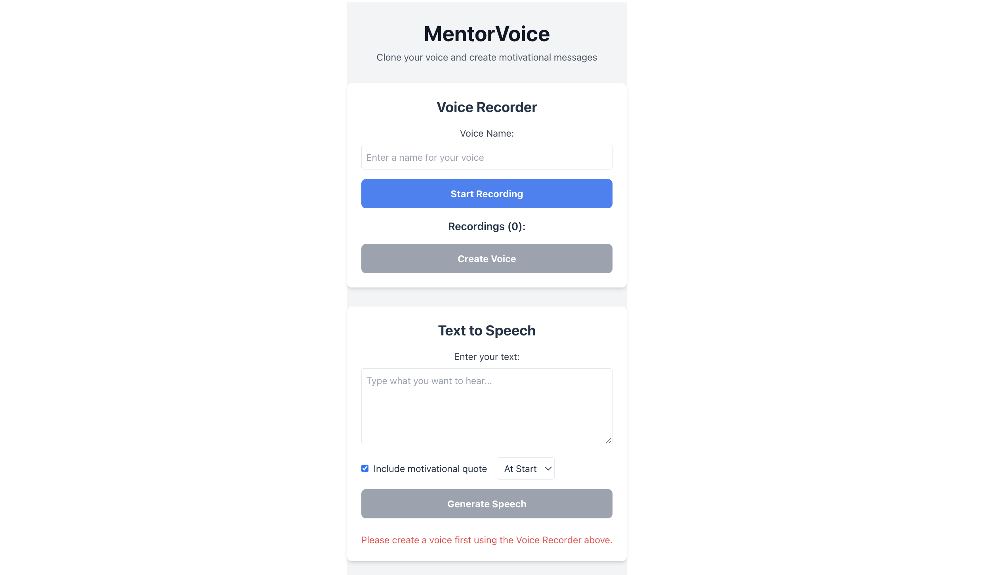

# MentorshipVoiceCloner

A motivational text-to-speech app that clones your voice and delivers custom mentorship messages with a personal touch.



## 🧠 What It Does

**MentorVoice** allows users to:

- Record a few voice samples
- Clone their voice using AI (via ElevenLabs)
- Type custom prompts
- Hear those prompts spoken back in their own voice with a motivational mentor tone
- Get daily mentorship quotes automatically embedded

Perfect for self-guided encouragement, coaching, or sharing inspiring messages with others.

---

## 📦 Tech Stack

- **Frontend**: React + TailwindCSS
- **Backend**: Netlify Functions (Node.js or Python)
- **Voice Cloning & TTS**: [ElevenLabs API](https://www.elevenlabs.io/)
- **Hosting**: Netlify

---

## 🚀 Getting Started

### 1. Clone the Repo

```bash
git clone https://github.com/YOUR_USERNAME/mentor-voice.git
cd mentor-voice
